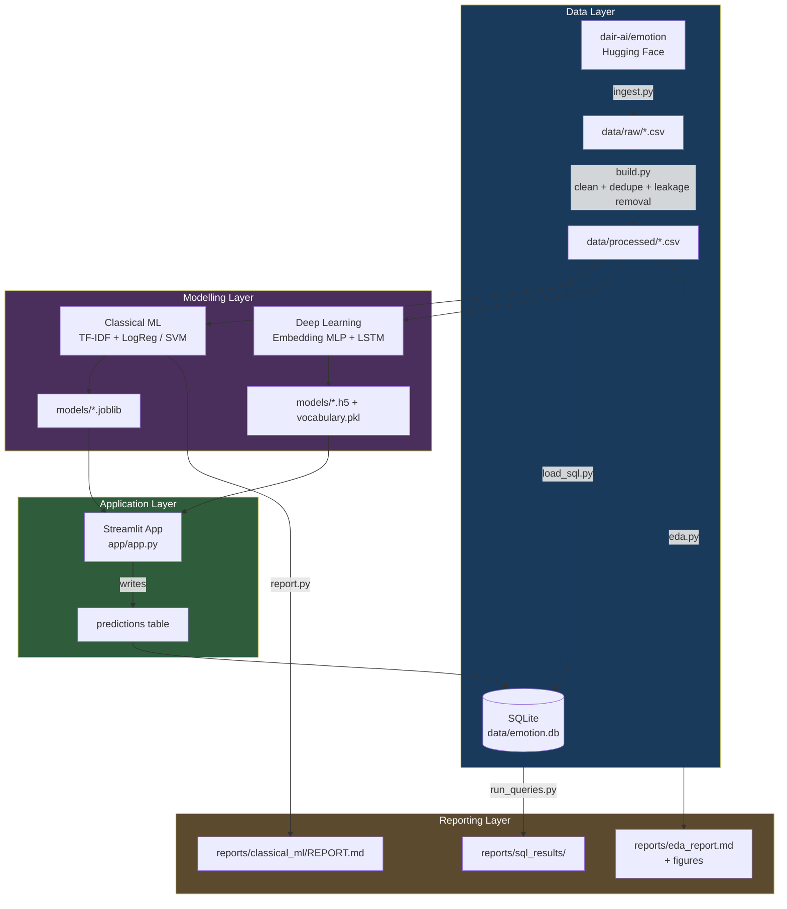

# System Architecture

## Layer summary

| Layer | Owner | Key artifact |
|---|---|---|
| Data | Member 1 | `data/emotion.db`, `data/processed/*.csv` |
| Classical ML | Member 2 | `models/*.joblib`, `reports/classical_ml/REPORT.md` |
| Deep learning | Member 3 | `models/*.h5`, `models/vocabulary.pkl` |
| Application | Member 4 | `app/app.py`, Docker |

## Data flow

1. Raw text is downloaded once and cleaned into leakage-safe train/validation/test splits.
2. The same processed splits feed both the classical and deep-learning tracks, so results are comparable.
3. Trained models are loaded by the Streamlit app at runtime.
4. Every prediction made through the app is written back into the `predictions`
   table in the shared SQLite database, which is what the analytical SQL
   queries (model comparison, per-class recall, confusion pairs) read from.
