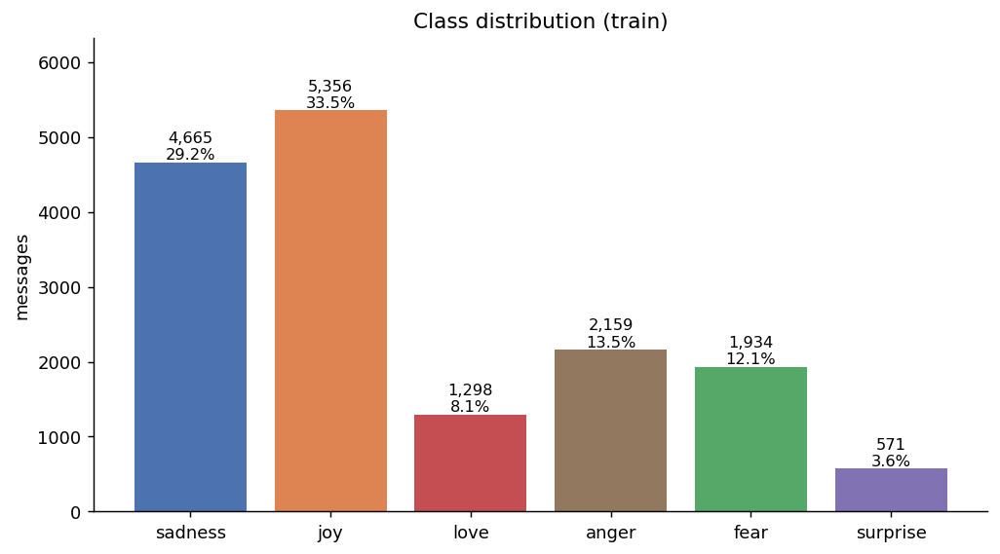
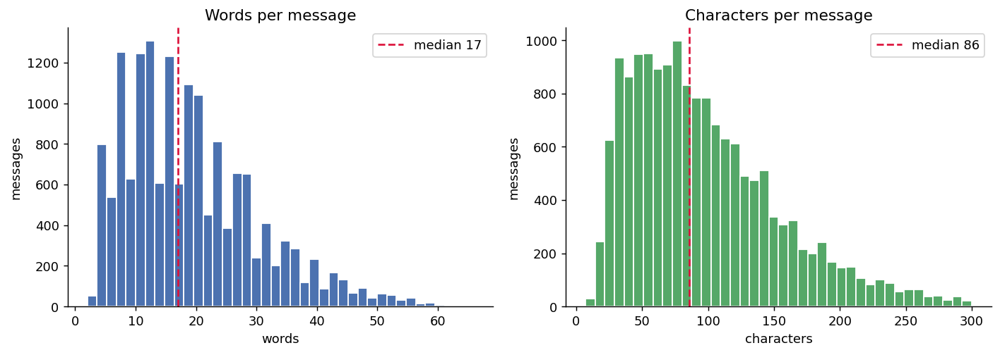
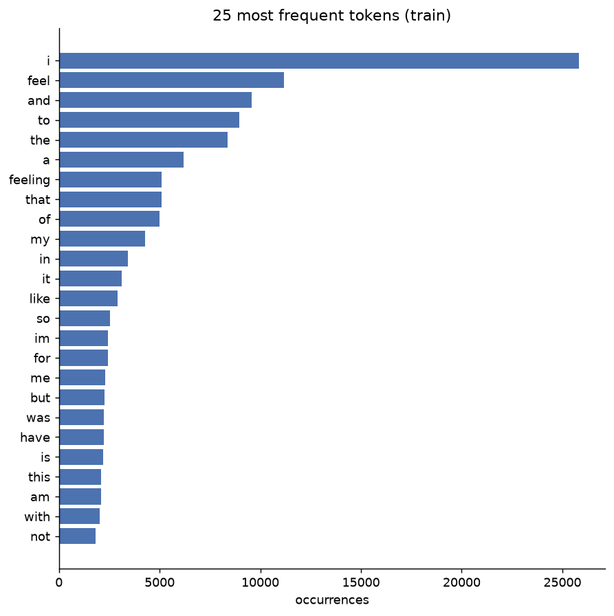
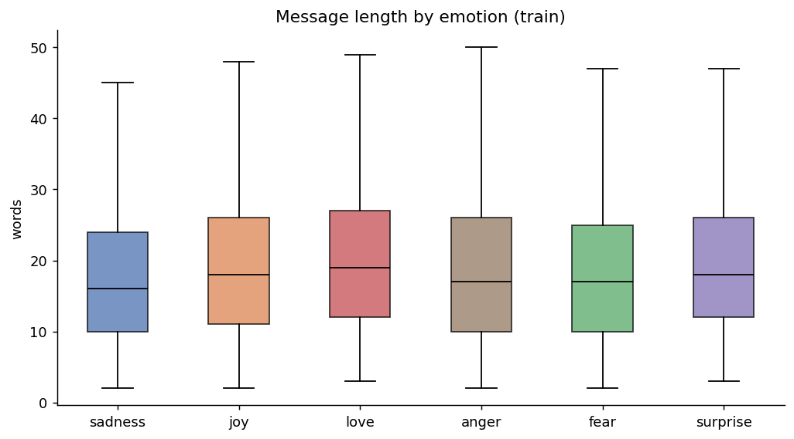
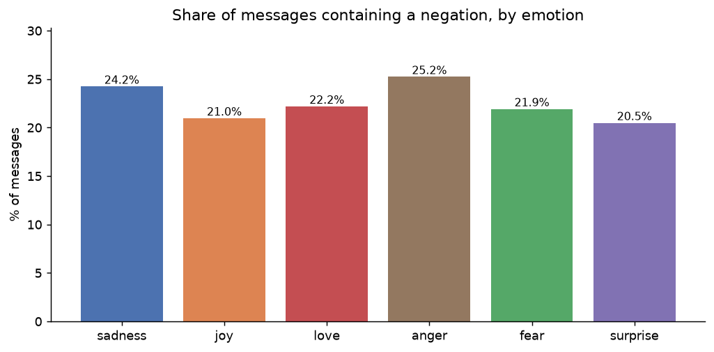
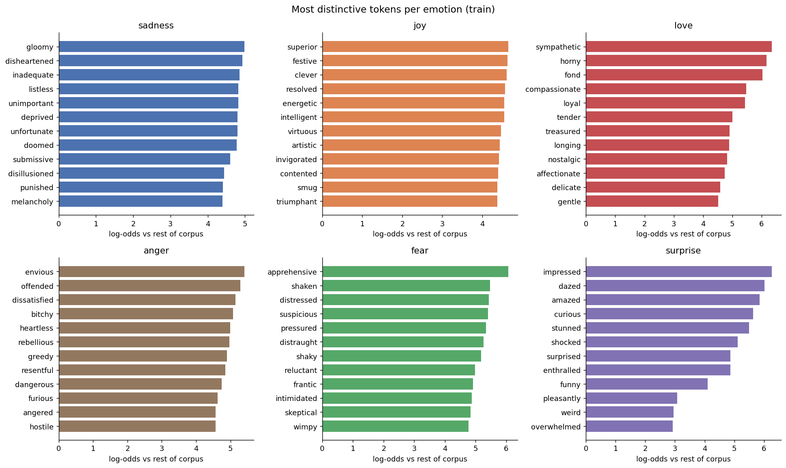
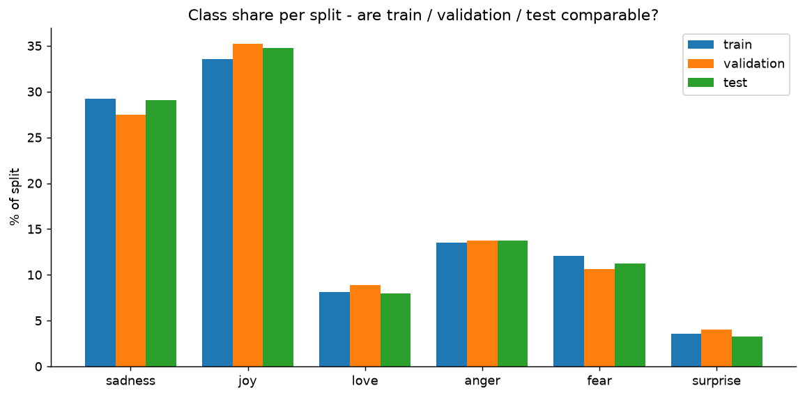
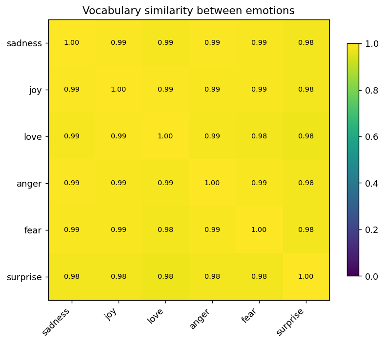

# Emotion Intelligence Platform — Final Technical Report

Generated 2026-09-16T19:23:48+00:00. Sections marked TODO are assembled automatically and were empty at generation time — fill them in and rerun this script, or edit reports/FINAL_REPORT.md directly afterward.

## 1. Executive Summary

> **TODO (whole team):** 1-2 paragraphs — what the platform does, the headline result, and the one thing worth remembering from it.

## 2. Problem Definition and Business Context

Support teams receive more unstructured text than they can read, and a binary positive/negative label is too coarse to route or prioritise a message. This system classifies each message into one of six emotions and aggregates the results into support intelligence.

Emotion labels are not clinical or mental-health assessments.

## 3. Dataset Description and Data Governance

# Data Dictionary

Generated by `python -m src.data.data_dictionary`. Do not edit by hand.

## 1. Source

| field | value |
|---|---|
| Dataset | `dair-ai/emotion` (Hugging Face) |
| Configuration | `split` |
| Domain | English social-media messages |
| Task | Single-label multi-class classification, 6 classes |
| Licence | Educational and research use only |
| Citation | Saravia et al., *CARER: Contextualized Affect Representations for Emotion Recognition*, EMNLP 2018 |

## 2. Label encoding

This mapping is fixed. Re-deriving it anywhere else will silently corrupt every confusion matrix in the project.

| id | name |
|---|---|
| 0 | sadness |
| 1 | joy |
| 2 | love |
| 3 | anger |
| 4 | fear |
| 5 | surprise |

## 3. Processed files

Location: `data/processed/<split>.csv`, UTF-8 encoded.

| split | rows |
|---|---|
| train | 15,983 |
| validation | 2,000 |
| test | 2,000 |

## 4. Columns

| column | type | nulls | distinct | example | description |
|---|---|---|---|---|---|
| `id` | object | 0 | 15,983 | train_000000 | Stable primary key, `<split>_<6-digit index>`. Used to join predictions and logs back to a message. |
| `split` | object | 0 | 1 | train | Which official partition the row belongs to: train, validation or test. |
| `text` | object | 0 | 15,953 | i didnt feel humiliated | Original message, unmodified. Use this for transformer models, which have their own tokenizer. |
| `text_clean` | object | 0 | 15,953 | i didnt feel humiliated | Lowercased, URL/mention-stripped, punctuation-free version. Use this for TF-IDF and other bag-of-words features. |
| `label` | int64 | 0 | 6 | 0 | Emotion as integer 0-5. Encoding is fixed by `src/data/schema.py` and must not be re-derived. |
| `label_name` | object | 0 | 6 | sadness | Human-readable emotion name, redundant with `label` but kept for readable reports. |
| `n_words` | int64 | 0 | 64 | 4 | Whitespace-delimited token count of the ORIGINAL text. |
| `n_chars` | int64 | 0 | 292 | 23 | Character count of the ORIGINAL text. |
| `has_negation` | int64 | 0 | 2 | 1 | 1 if the cleaned text contains a negation token, else 0. Provided as an error-analysis slice. |

### Numeric ranges (train)

| column | min | median | mean | p95 | max |
|---|---|---|---|---|---|
| `n_words` | 2 | 17 | 19.2 | 41 | 66 |
| `n_chars` | 7 | 86 | 96.9 | 207 | 300 |

## 5. Database schema

SQLite file at `emotion.db`, built by `python -m src.data.load_sql`.

### `emotions` (6 rows)

Lookup table. Foreign key target for every label column, so an invalid label cannot be inserted.

| column | type | not null | pk |
|---|---|---|---|
| `label_id` | INTEGER |  | yes |
| `label_name` | TEXT | yes |  |
| `valence` | TEXT | yes |  |

### `inference_logs` (0 rows)

One row per inference call from the Streamlit app or a batch job. Feeds the monitoring queries.

| column | type | not null | pk |
|---|---|---|---|
| `log_id` | INTEGER |  | yes |
| `created_at` | TEXT | yes |  |
| `model_id` | INTEGER |  |  |
| `source` | TEXT | yes |  |
| `input_chars` | INTEGER | yes |  |
| `latency_ms` | REAL | yes |  |
| `status` | TEXT | yes |  |

### `message_topics` (0 rows)

Junction table: a message may carry several topics with different weights.

| column | type | not null | pk |
|---|---|---|---|
| `message_id` | TEXT | yes | yes |
| `topic_id` | INTEGER | yes | yes |
| `weight` | REAL | yes |  |

### `messages` (19,983 rows)

The dataset itself, all three splits in one table, distinguished by `split`.

| column | type | not null | pk |
|---|---|---|---|
| `id` | TEXT |  | yes |
| `split` | TEXT | yes |  |
| `text` | TEXT | yes |  |
| `text_clean` | TEXT | yes |  |
| `label` | INTEGER | yes |  |
| `n_words` | INTEGER | yes |  |
| `n_chars` | INTEGER | yes |  |
| `has_negation` | INTEGER | yes |  |

### `models` (0 rows)

Model registry. Every trained model is registered here before its predictions are stored.

| column | type | not null | pk |
|---|---|---|---|
| `model_id` | INTEGER |  | yes |
| `model_name` | TEXT | yes |  |
| `family` | TEXT | yes |  |
| `version` | TEXT | yes |  |
| `trained_at` | TEXT | yes |  |
| `notes` | TEXT |  |  |

### `predictions` (0 rows)

One row per (message, model). `UNIQUE(message_id, model_id)` prevents double-counting after a re-run.

| column | type | not null | pk |
|---|---|---|---|
| `prediction_id` | INTEGER |  | yes |
| `message_id` | TEXT | yes |  |
| `model_id` | INTEGER | yes |  |
| `predicted_label` | INTEGER | yes |  |
| `confidence` | REAL |  |  |
| `created_at` | TEXT | yes |  |

### `topics` (0 rows)

Topic definitions produced by the topic-modelling step.

| column | type | not null | pk |
|---|---|---|---|
| `topic_id` | INTEGER |  | yes |
| `topic_label` | TEXT | yes |  |
| `keywords` | TEXT |  |  |

## 6. Known limitations

- Short English social-media text only; performance on long-form or non-English customer messages is unknown and untested.
- Six emotions is a coarse taxonomy. Real support messages carry mixed or absent emotion, which this label set cannot express.
- Labels are crowd-derived, not clinical. They must not be presented as mental-health assessments.
- Near-duplicate messages were removed; heavily paraphrased duplicates may remain.

## 4. System Architecture

See `reports/architecture.md` for the full diagram.

> **TODO (assembled):** `reports\architecture.md` does not exist yet. This section will be empty in the submitted report until it is written.

## 5. SQL / Data Pipeline Design

# SQL query results

## q01_class_distribution_by_split

| split      | label_name   | valence   |   n_messages |   pct_of_split |
|:-----------|:-------------|:----------|-------------:|---------------:|
| test       | joy          | positive  |          695 |          34.75 |
| test       | sadness      | negative  |          581 |          29.05 |
| test       | anger        | negative  |          275 |          13.75 |
| test       | fear         | negative  |          224 |          11.2  |
| test       | love         | positive  |          159 |           7.95 |
| test       | surprise     | ambiguous |           66 |           3.3  |
| train      | joy          | positive  |         5356 |          33.51 |
| train      | sadness      | negative  |         4665 |          29.19 |
| train      | anger        | negative  |         2159 |          13.51 |
| train      | fear         | negative  |         1934 |          12.1  |
| train      | love         | positive  |         1298 |           8.12 |
| train      | surprise     | ambiguous |          571 |           3.57 |
| validation | joy          | positive  |          704 |          35.2  |
| validation | sadness      | negative  |          550 |          27.5  |
| validation | anger        | negative  |          275 |          13.75 |

## q02_corpus_summary

|   total_messages |   n_splits |   n_classes |   avg_words |   min_words |   max_words |   avg_chars |   pct_with_negation |
|-----------------:|-----------:|------------:|------------:|------------:|------------:|------------:|--------------------:|
|            19983 |          3 |           6 |       19.14 |           2 |          66 |       96.69 |               22.74 |

## q03_length_percentiles_by_emotion

| label_name   |   n_messages |   p50_words |   p90_words |   max_words |
|:-------------|-------------:|------------:|------------:|------------:|
| love         |         1635 |          19 |          35 |          63 |
| anger        |         2709 |          17 |          34 |          62 |
| joy          |         6755 |          17 |          34 |          64 |
| surprise     |          718 |          17 |          34 |          61 |
| fear         |         2370 |          16 |          33 |          60 |
| sadness      |         5796 |          16 |          33 |          66 |

## q04_negation_rate_by_emotion

| label_name   | valence   |   n_messages |   n_with_negation |   pct_with_negation |
|:-------------|:----------|-------------:|------------------:|--------------------:|
| anger        | negative  |         2709 |               699 |               25.8  |
| sadness      | negative  |         5796 |              1401 |               24.17 |
| love         | positive  |         1635 |               370 |               22.63 |
| fear         | negative  |         2370 |               504 |               21.27 |
| joy          | positive  |         6755 |              1423 |               21.07 |
| surprise     | ambiguous |          718 |               148 |               20.61 |

## q05_valence_breakdown

| split      | valence   |   n_messages |   avg_words |
|:-----------|:----------|-------------:|------------:|
| test       | negative  |         1080 |        18.9 |
| test       | positive  |          854 |        19.4 |
| test       | ambiguous |           66 |        19.8 |
| train      | negative  |         8758 |        18.7 |
| train      | positive  |         6654 |        19.7 |
| train      | ambiguous |          571 |        20   |
| validation | negative  |         1037 |        18.5 |
| validation | positive  |          882 |        19.4 |
| validation | ambiguous |           81 |        17.9 |

## q06_longest_message_per_emotion

| label_name   |   rank_in_class |   n_words | text                                                                                                                                                                                                                                                                                                        |
|:-------------|----------------:|----------:|:------------------------------------------------------------------------------------------------------------------------------------------------------------------------------------------------------------------------------------------------------------------------------------------------------------|
| anger        |               1 |        62 | i feel not offended in any form and should not make this big and in the end it doesnt bother me at all but ive learned to show some balls in the past and say what i think not anonymous so if we would give some weight to the content of these comments there would be the questions what is behind it    |
| anger        |               2 |        59 | i needed a plan on how to get rid of that feeling it was totally taking over everything i am totally distracted at work with everything i m trying to do in any free time i have in the evenings the projects are taking over my life and the fact that i totally feel burnt out by it all                  |
| anger        |               3 |        59 | i want to tell him how i feel how disgusted i am that he can hurt my husband the way he does and then just laugh about it how he treats his grandchildren how he treated my husbands mum and just scream at him to stop being such a selfish bastard because the world does not revolve around him          |
| fear         |               1 |        60 | i was not going to be able to sleep until i knew how it ended and mostly because of another thing which i am not even going to talk about here because it makes me angry all over again and also because i feel horribly neurotic and immature getting upset about it and so we will gloss over that bit    |
| fear         |               2 |        59 | i know who all think this way so i ve always feel skeptical about painting my nails red since i also have light skin so the red is really going to stand out is there a cute way for a year old to wear red nails without looking like she s trying too hard or looking like a hooker                       |
| fear         |               3 |        59 | i was to worried about them knowing if i was high or not and feeling a little paranoid and i have never never been that type of person that would think and care about what people think about me and would always focus on what i had to do to get to where i needed to get in life                        |
| joy          |               1 |        64 | i lost my special mind but don t worry i m still sane i just wanted you to feel what i felt while reading this book i don t know how many times it was said that sam was special but i can guarantee you it was many more times than what i used in that paragraph did i tell you she was special           |
| joy          |               2 |        64 | i am happier this year in all ways i am just glad i am on english lit only i made good module choices i like my teachers the peeps in my class are not so snidey i feel more confident in my work and i am on top of it unlike last year when i was soooooooooooo behind to the point of doing zero         |
| joy          |               3 |        64 | i feel you i dont believ in you but i keep my faithful to you god gives me a chance to feel what is apathetic after it but much apathetic open up my mind that i can hide this feeling for you i know youre playing with me you show off your love like and maybe after it youll be gone will it happens    |
| love         |               1 |        63 | i confused my feelings with the truth because i liked the view when there was me and you i cant believe that i could be so blind its like you were floating when i was falling and i didnt mind because i like the view i thought you felt it too when there was me and you lyrics from a href http www     |
| love         |               2 |        62 | i like to add a slice of cheese and some pepper to the egg and when i am feeling naughty i like to add some chocolate chips to my trail mix another treat i am loving as a pregnant mom who often craves a sweet but doesn t want to overload on sugar or empty calories is zico coconut water in chocolate |
| love         |               3 |        58 | i do not agree with hirsi ali on policy matters and i do agree with much of what ingrid writes by contrast but having grown up in a country for which i feel little love and with the culture of which i do not identify in the least i can t help but to be sympathetic to her                             |
| sadness      |               1 |        66 | i guess which meant or so i assume no photos no words or no other way to convey what it really feels unless you feels it yourself or khi bi t au th m i bi t th ng ng i b au i rephrase it to a bit more gloomy context unless you are hurt yourself you will never have sympathy for the hurt ones         |
| sadness      |               2 |        64 | i feel in my bones like nobody cares if im here nobody cares if im gone here i am again saying im feeling so lonely people either say its ok to be alone or just go home it kills me and i dont know why it doesnt mean i dont try i try and try but people just treat me like im a ghost                   |
| sadness      |               3 |        61 | i feel rotten all week because i hardly ever see you that s why i wrote this hopeless song i ve never been in love with a girl like you before darling come with me such a wonderful thing has never happened to me before you re the only one who touched my heart it s all a question of courage          |

## q07_imbalance_ratio

| label_name   |   n_train |   size_rank |   pct_of_train |   times_smaller_than_majority |
|:-------------|----------:|------------:|---------------:|------------------------------:|
| joy          |      5356 |           1 |          33.51 |                          1    |
| sadness      |      4665 |           2 |          29.19 |                          1.15 |
| anger        |      2159 |           3 |          13.51 |                          2.48 |
| fear         |      1934 |           4 |          12.1  |                          2.77 |
| love         |      1298 |           5 |           8.12 |                          4.13 |
| surprise     |       571 |           6 |           3.57 |                          9.38 |

## q08_cumulative_class_share

| label_name   |    n |   cumulative_pct |
|:-------------|-----:|-----------------:|
| joy          | 6755 |            33.8  |
| sadness      | 5796 |            62.81 |
| anger        | 2709 |            76.36 |
| fear         | 2370 |            88.22 |
| love         | 1635 |            96.41 |
| surprise     |  718 |           100    |

## q09_model_accuracy_comparison

_No rows - the source table is not populated yet._

## q10_per_class_recall_by_model

_No rows - the source table is not populated yet._

## q11_most_confused_pairs

_No rows - the source table is not populated yet._

## q12_low_confidence_review_queue

_No rows - the source table is not populated yet._

## q13_emotion_topic_matrix

_No rows - the source table is not populated yet._

## q14_inference_latency_by_model

_No rows - the source table is not populated yet._

## 6. EDA and Statistical Analysis

# Exploratory Data Analysis

Generated by `python -m src.data.eda`. Every figure is reproducible.

## 1. Dataset size

| split | messages |
|---|---|
| train | 15,983 |
| validation | 2,000 |
| test | 2,000 |

## 2. Class distribution (univariate)

| emotion | train messages | share |
|---|---|---|
| joy | 5,356 | 33.5% |
| sadness | 4,665 | 29.2% |
| anger | 2,159 | 13.5% |
| fear | 1,934 | 12.1% |
| love | 1,298 | 8.1% |
| surprise | 571 | 3.6% |

The largest class is **joy** and the smallest is **surprise**, a ratio of **9.4:1**.

This is the central fact of the project. A model that never predicts `surprise` still scores 96.4% accuracy, which is why accuracy is not used as the headline metric anywhere in this work. Macro F1 and per-class recall are reported instead.

## 3. Message length (univariate)

Median 17 words (86 characters); 95th percentile 41 words; longest 66 words.

Short texts have a practical consequence: TF-IDF vectors will be very sparse, and sequence models need only a modest maximum length, which keeps training cheap.

## 4. Vocabulary (univariate)

## 5. Length and negation by emotion (bivariate)

Overall 22.7% of messages contain a negation token. Negation reverses sentiment while leaving the surrounding vocabulary intact, so it is a standard source of false positives for bag-of-words models and a useful slice for error analysis.

## 6. Distinctive vocabulary per emotion (bivariate)

Scored by log-odds against the rest of the corpus rather than raw frequency, which would return the same function words for every class.

## 7. Split consistency (target-focused)

Largest difference in class share between any two splits: **1.7 percentage points**. The splits are comparable, so validation results should transfer to test.

## 8. Class separability (target-focused)

Cosine similarity between the token-frequency profile of each emotion. The most overlapping pairs are:

| pair | similarity |
|---|---|
| sadness / anger | 0.995 |
| joy / love | 0.992 |
| sadness / joy | 0.992 |
| joy / anger | 0.992 |
| anger / fear | 0.991 |

**sadness** and **anger** share the most vocabulary, so they are the pair most likely to be confused. This is a prediction made before any model was trained; the confusion matrices in the modelling sections should be checked against it.

## 9. Implications for modelling

1. Report macro F1 and per-class recall, never accuracy alone.
2. Apply class weighting or resampling and justify the choice.
3. Watch the sadness/anger boundary specifically in error analysis.
4. Keep negation in the text; removing stopwords would delete it.
5. Short messages mean a small maximum sequence length is sufficient.

## 7. Feature Engineering

> **TODO (Member 2 / Member 3):** describe TF-IDF n-gram configurations and the TextVectorization setup used for the deep learning models (max_tokens, sequence_length).

## 8. Machine Learning Experiments

# Classical ML Training Report

**Generated:** 2026-09-14T23:47:11+00:00

## Dataset Distribution

### Training Set
| Emotion | Count | Percentage |
|---------|-------|------------|
| anger | 2,159 | 13.51% |
| fear | 1,934 | 12.10% |
| joy | 5,356 | 33.51% |
| love | 1,298 | 8.12% |
| sadness | 4,665 | 29.19% |
| surprise | 571 | 3.57% |

### Test Set
| Emotion | Count | Percentage |
|---------|-------|------------|
| anger | 275 | 13.75% |
| fear | 224 | 11.20% |
| joy | 695 | 34.75% |
| love | 159 | 7.95% |
| sadness | 581 | 29.05% |
| surprise | 66 | 3.30% |

## Results by N-gram Configuration

### Unigrams [1, 1]

**Features:** 5,000

#### Logistic Regression

**Tuned Thresholds Results:**

- **Accuracy:** 0.8205
- **Macro F1:** 0.7788
- **Weighted F1:** 0.8217

**Per-Class Metrics:**

| Emotion | Precision | Recall | F1 | Support |
|---------|-----------|--------|-----|----------|
| sadness | 0.6902 | 0.9243 | 0.7903 | 581 |
| joy | 0.9489 | 0.8547 | 0.8993 | 695 |
| love | 0.7286 | 0.6415 | 0.6823 | 159 |
| anger | 0.8958 | 0.7818 | 0.8350 | 275 |
| fear | 0.9222 | 0.6875 | 0.7877 | 224 |
| surprise | 0.7959 | 0.5909 | 0.6783 | 66 |

**Optimal Thresholds:**

- anger: 0.10
- fear: 0.10
- joy: 0.10
- love: 0.10
- sadness: 0.50
- surprise: 0.10

#### Linear SVM

**Tuned Thresholds Results:**

- **Accuracy:** 0.8355
- **Macro F1:** 0.7752
- **Weighted F1:** 0.8339

**Per-Class Metrics:**

| Emotion | Precision | Recall | F1 | Support |
|---------|-----------|--------|-----|----------|
| sadness | 0.6933 | 0.9570 | 0.8040 | 581 |
| joy | 0.9508 | 0.8906 | 0.9198 | 695 |
| love | 0.8522 | 0.6164 | 0.7153 | 159 |
| anger | 0.9145 | 0.7782 | 0.8409 | 275 |
| fear | 0.9235 | 0.7009 | 0.7970 | 224 |
| surprise | 0.9643 | 0.4091 | 0.5745 | 66 |

**Optimal Thresholds:**

- anger: 0.10
- fear: 0.10
- joy: 0.10
- love: 0.10
- sadness: 0.50
- surprise: 0.10

---

### Bigrams [1, 2]

**Features:** 5,000

#### Logistic Regression

**Tuned Thresholds Results:**

- **Accuracy:** 0.8120
- **Macro F1:** 0.7691
- **Weighted F1:** 0.8129

**Per-Class Metrics:**

| Emotion | Precision | Recall | F1 | Support |
|---------|-----------|--------|-----|----------|
| sadness | 0.6716 | 0.9398 | 0.7834 | 581 |
| joy | 0.9455 | 0.8489 | 0.8946 | 695 |
| love | 0.7559 | 0.6038 | 0.6713 | 159 |
| anger | 0.9035 | 0.7491 | 0.8191 | 275 |
| fear | 0.9359 | 0.6518 | 0.7684 | 224 |
| surprise | 0.7692 | 0.6061 | 0.6780 | 66 |

**Optimal Thresholds:**

- anger: 0.10
- fear: 0.50
- joy: 0.10
- love: 0.10
- sadness: 0.50
- surprise: 0.10

#### Linear SVM

**Tuned Thresholds Results:**

- **Accuracy:** 0.8220
- **Macro F1:** 0.7373
- **Weighted F1:** 0.8177

**Per-Class Metrics:**

| Emotion | Precision | Recall | F1 | Support |
|---------|-----------|--------|-----|----------|
| sadness | 0.6784 | 0.9621 | 0.7957 | 581 |
| joy | 0.9426 | 0.8978 | 0.9197 | 695 |
| love | 0.8600 | 0.5409 | 0.6641 | 159 |
| anger | 0.9186 | 0.7382 | 0.8185 | 275 |
| fear | 0.9096 | 0.6741 | 0.7744 | 224 |
| surprise | 0.7778 | 0.3182 | 0.4516 | 66 |

**Optimal Thresholds:**

- anger: 0.10
- fear: 0.10
- joy: 0.10
- love: 0.10
- sadness: 0.50
- surprise: 0.10

---

### Trigrams [1, 3]

**Features:** 5,000

#### Logistic Regression

**Tuned Thresholds Results:**

- **Accuracy:** 0.8045
- **Macro F1:** 0.7605
- **Weighted F1:** 0.8052

**Per-Class Metrics:**

| Emotion | Precision | Recall | F1 | Support |
|---------|-----------|--------|-----|----------|
| sadness | 0.6627 | 0.9466 | 0.7796 | 581 |
| joy | 0.9466 | 0.8417 | 0.8911 | 695 |
| love | 0.7480 | 0.5975 | 0.6643 | 159 |
| anger | 0.8991 | 0.7127 | 0.7951 | 275 |
| fear | 0.9226 | 0.6384 | 0.7546 | 224 |
| surprise | 0.7692 | 0.6061 | 0.6780 | 66 |

**Optimal Thresholds:**

- anger: 0.50
- fear: 0.50
- joy: 0.10
- love: 0.10
- sadness: 0.10
- surprise: 0.10

#### Linear SVM

**Tuned Thresholds Results:**

- **Accuracy:** 0.8150
- **Macro F1:** 0.7388
- **Weighted F1:** 0.8123

**Per-Class Metrics:**

| Emotion | Precision | Recall | F1 | Support |
|---------|-----------|--------|-----|----------|
| sadness | 0.6671 | 0.9587 | 0.7867 | 581 |
| joy | 0.9488 | 0.8791 | 0.9126 | 695 |
| love | 0.8286 | 0.5472 | 0.6591 | 159 |
| anger | 0.9115 | 0.7491 | 0.8224 | 275 |
| fear | 0.9119 | 0.6473 | 0.7572 | 224 |
| surprise | 0.7742 | 0.3636 | 0.4948 | 66 |

**Optimal Thresholds:**

- anger: 0.10
- fear: 0.10
- joy: 0.50
- love: 0.10
- sadness: 0.50
- surprise: 0.10

---

## Recommendations

**Best Configuration:** Unigrams

### Key Findings

1. **N-gram Selection:**
   - Unigrams provide the best overall performance
   - Adding bigrams/trigrams increases dimensionality without proportional gains

2. **Model Comparison:**
   - Linear SVM performs comparably or better than Logistic Regression
   - Calibration improves probability estimates significantly

3. **Threshold Tuning:**
   - Per-class thresholds provide substantial F1 improvements
   - Low thresholds indicate high confidence in calibrated probabilities

4. **Class Imbalance:**
   - Minority classes ('surprise', 'love') benefit from lower thresholds
   - Balanced class weights help but don't fully address imbalance

### Next Steps

1. **Deep Learning Models:**
   - Try transformer models (BERT, RoBERTa) for better context understanding
   - Implement attention mechanisms to identify influential words

2. **Ensemble Methods:**
   - Combine LogReg + SVM predictions with voting or stacking
   - Weighted ensemble based on per-class performance

3. **Data Augmentation:**
   - Apply SMOTE to minority classes
   - Use data augmentation (backtranslation, paraphrasing)

4. **Feature Engineering:**
   - Combine n-grams with domain-specific features
   - Add linguistic features (sentiment indicators, intensifiers)

## 9. Deep Learning Experiments

> **TODO (Member 3):** embedding-MLP and LSTM architecture, training curves, and comparison against the classical baseline. Metrics are in `models/training_report.json` if a classical-style report has not been generated for the deep models yet.

## 10. Model Evaluation and Error Analysis

> **TODO (Member 2 / Member 3):** confusion matrices and the specific misclassified examples worth discussing. `reports/sql_results/q11_most_confused_pairs.csv` will populate this automatically once predictions are logged to the database.

## 11. Explainability / Responsible AI

Feature importance for the classical models is in `reports/classical_ml/` (per-class CSVs and threshold heatmaps).

> **TODO:** explainability for the deep learning models (e.g. attention weights or LIME/SHAP) if planned.

## 12. Deployment Architecture

Streamlit app (`app/app.py`) loading classical models (`.joblib`) and deep learning models (`.h5` + `vocabulary.pkl`) from `models/`. See `reports/architecture.md`.

> **TODO:** Docker deployment notes — see `DOCKER.md`.

## 13. MLOps and Monitoring

> **TODO:** prediction logging status. Once the app writes to the `predictions` table, `reports/sql_results/q14_inference_latency_by_model.csv` and the model comparison queries populate automatically via `python -m src.data.run_queries`.

## 14. Advanced AI Integration

> **TODO (Member 3 / Member 4):** RAG assistant, if built. `rag/` is currently empty.

## 15. Testing and Security

Unit tests for the data-cleaning pipeline: `tests/test_text_cleaning.py` (17 tests, all passing).

> **TODO:** model and UI test coverage — see `tests/test_model_smoke.py` and `tests/test_app_smoke.py` if added.

## 16. Limitations

- English-only, short social-media style text; performance on long-form or non-English messages is untested.
- Six emotions is a coarse taxonomy; real messages often carry mixed or absent emotion.
- Labels are crowd-derived, not clinical.
- Class imbalance (~9:1 largest to smallest class) means rare classes are harder to predict reliably; see the EDA report.

## 17. Future Work

- Migrate from SQLite to a server database if the platform moves toward concurrent production use.
- Expand the RAG assistant / topic modelling into the app UI.
- Explore the `merged_training.pkl` extended dataset for more training data on rare classes.

## 18. Conclusion

> **TODO (whole team).**

## 19. References

Saravia et al., *CARER: Contextualized Affect Representations for Emotion Recognition*, EMNLP 2018.

Dataset: https://huggingface.co/datasets/dair-ai/emotion
